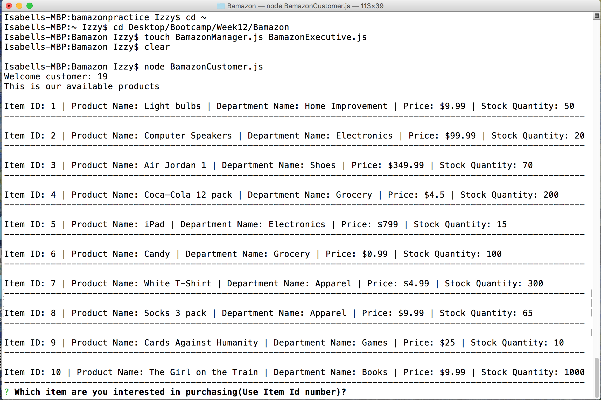
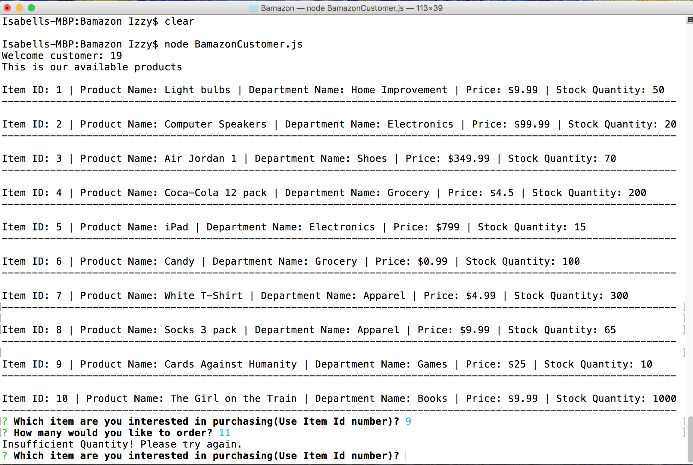
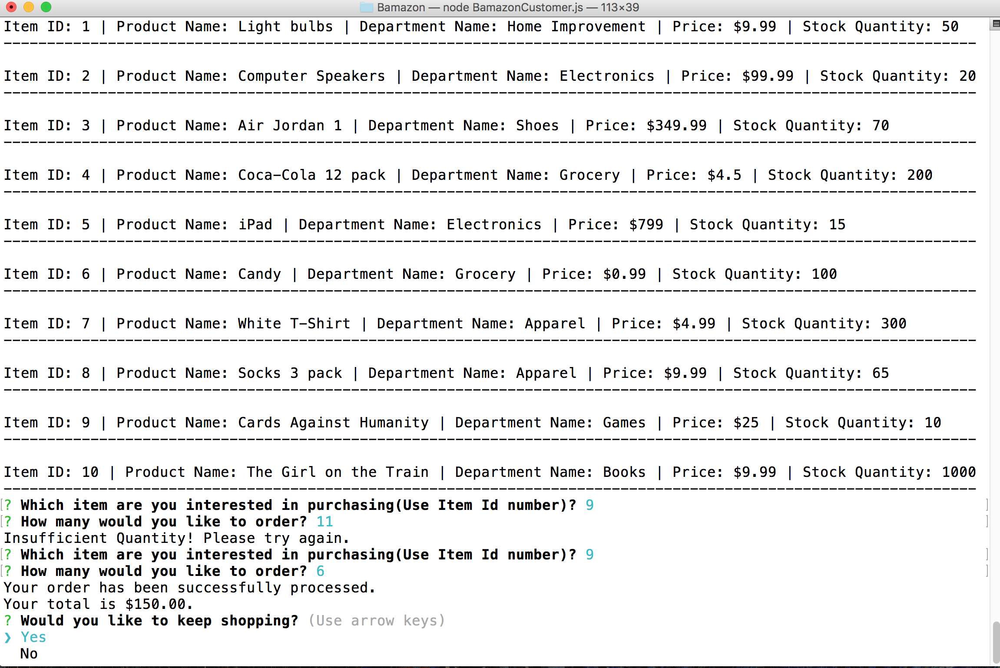
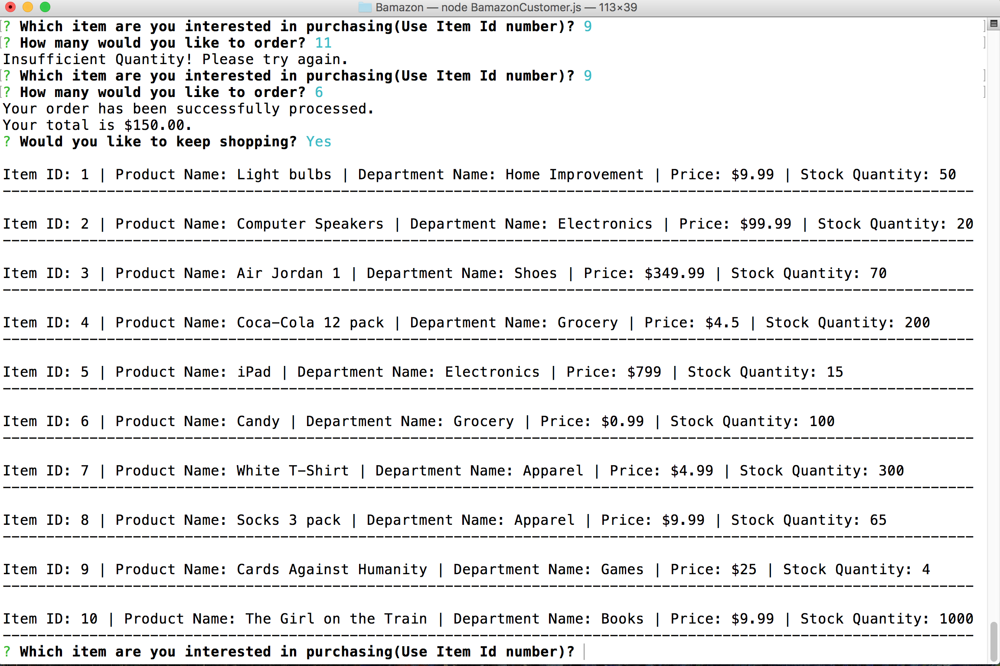
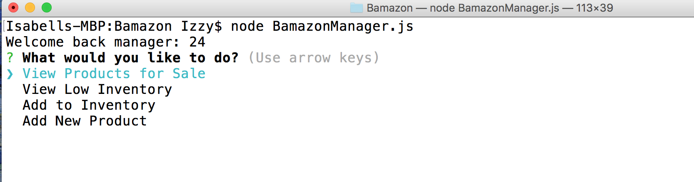
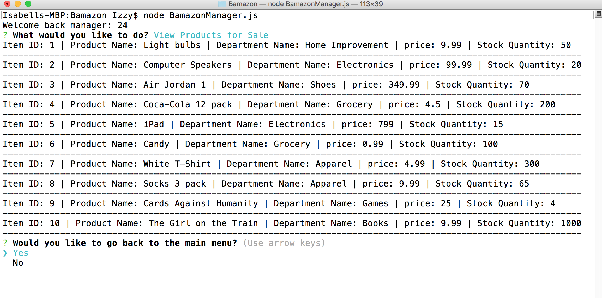
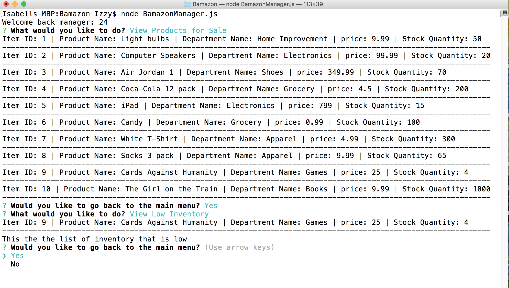
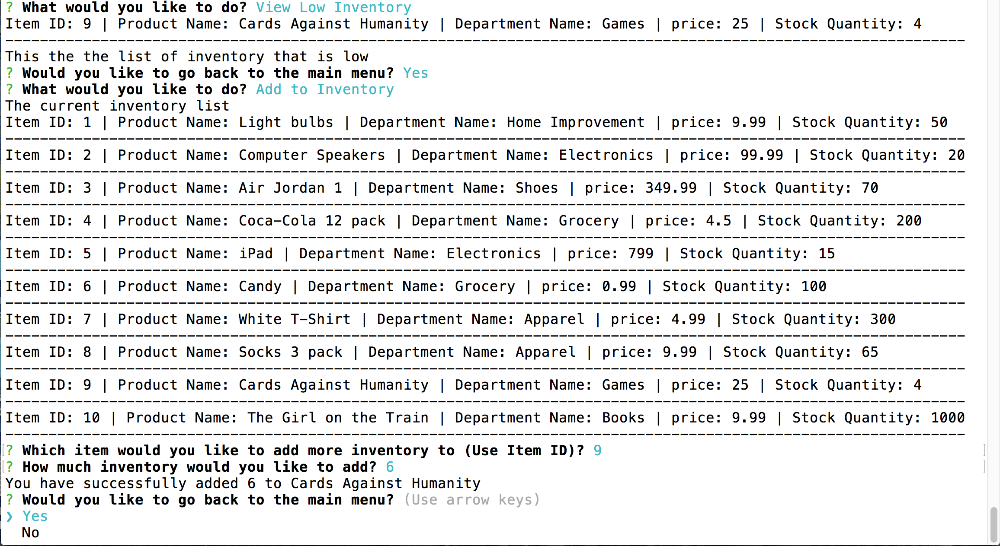
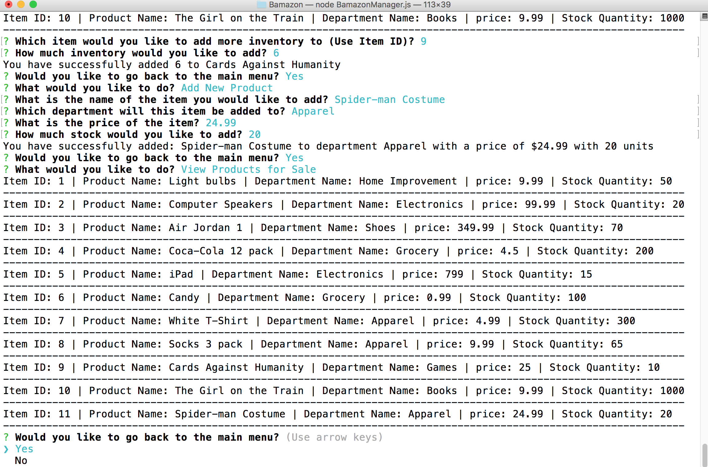

# Bamazon

##This is a node app with an Amazon-like storefront using MYSQL.

###The app can take in orders from customers and deplete stock from the store's inventory. 

###The manager can view inventory available for sale, view low inventory, add to the inventory stock, and add a new item to the inventory list.

###Below are the screen shots and explanations of how the app works

###The first thing that the customer sees when running "node BamazonCustomer.js" in the terminal is a list of the current inventory.

###The customer then chooses an item that they would like to purchase. In this case the customer chose item 9 and tried to buy 11 units of it. However, since there are only 10 items in stock it rejects the order and informs the customer that there is insufficient stock. 
 

###The customer then tries again to buy item 9 and instead buys an amount that is in stock. In this case, the customer purchases 6 units and has a total sale of $150 which goes through.

###The customer is then prompted if they would like to continue shopping. The customer chooses Yes and the list of the inventory repopulates with the updated list including reduced stock of the item that was purchased.

###The manager can run the program in the terminal with the command "node BamazonManager.js". The manager is given the choice to view inventory, view low inventory, add to the inventory, or add a new item.

###The manager chooses view inventory and a list of the available inventory for sale populates.

###The manager then gets prompted if they would like to go back to the main menu. The manager then chooses to view the low inventory. There is only 1 item listed with 4 units left in stock.

###The manager chooses to add stock to the inventory list. In this case, 6 units of item 9 are added to the stock.

###The manager chooses to add a new item to the inventory for sale. In this case, a Spider-man costume was added for $24.99 with 25 units. 

